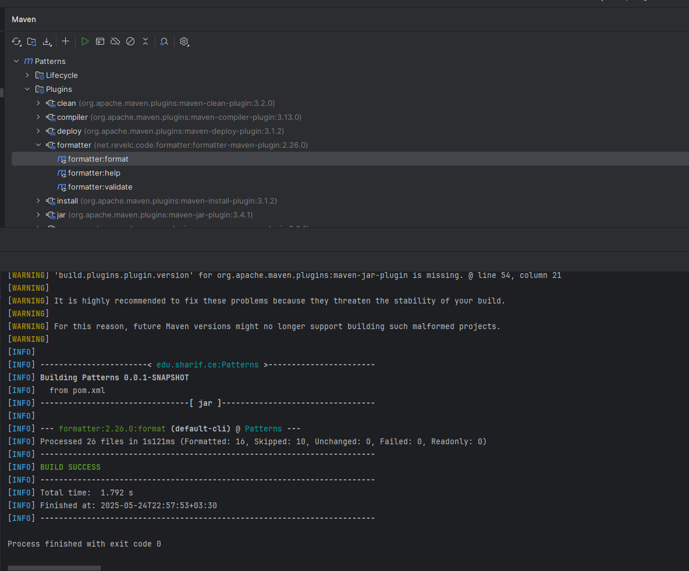
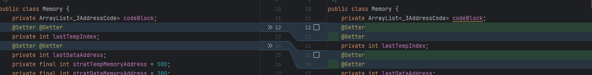

# بازآرایی


## بازآرایی`Facade`:
در کلاس 'parser' از `ParseTable` و `LexicalAnalyzer` استفاده شده است 
که این استفاده می تواند به واسطه یک `facade` انجام شود تا عملیات parse
از سمت کلاینت به صورت راحت تری اتفاق بیافتد و همچنان coupling کد
نسبت به این دو مورد کمتر شود.
برای این منظور کلاس
`ParserFacade` را ساختیم و صرفا ساخته شدن
`ParseTable` و `Rules`
را در کلاس
`Parser`
انجام میدهیم.
همچنان کد های کامنت شده را در این کلاس پاک کردیم.

مورد دیگری که می توان از این الگو استفاده کرد در کلاس
`CodeGenerator`
است.
در این کلاس از بخش های مختلفی مانند
`Memory`
و
'Stack'
استفاده میشود که اگر بتوان کار های مربوط به این داده ساختار ها را
در یک
`facade`
برد این قسمت بسیار تمیز خواهد شد.
این امر صرفا برای عملیات های مربوط به دو عدد صحیح
انجام شده است و به کلاس
`IntegerOperationCodeGenerator`
منتقل شده است.
 در این کلاس ارتباطات میان 
`memory`
و
`stack`
برای عملیات دو عدد صحیح مدیریت شده است و کلاس
`CodeGenerator`
بدون درگیر شدن با این داده ساختار ها برای عملیات های مذکور
صرفا از تابع این کلاس استفاده می کند.

---

## تکنیک `Self Encapsulated Field`:

در این تکنیک، برای استفاده از فیلد های `private` درون خود کلاس ها نیز از متد های `getter` و `setter` استفاده می کنیم. بازآرایی انجام شده در کلاس `Memory` می باشد و برای فیلد های `lastTempIndex` و `lastDataAddress` انجام شده است.

___

## تکنیک `Separate Query From Modifier`:

در این تکنیک تلاش می کنیم متد هایی را شناسایی کنیم که علاوه بر خروجی دادن داده ای را در حافظه تغییر می دهند. برای مثال تابع زیر در کلاس `Memory` هم مقدار `lastTempIndex` را تغییر داده و هم خروجی ای تولید می کند

```
public int getTemp() {
    setLastTempIndex(getLastTempIndex() + tempSize);
    return getLastTempIndex() - tempSize;
}
```

برای بارآرایی کردن این کد باید دو تابع مجزا برای تغییر دادن مقدار `lastTempIndex` و خروجی دادن مقدار آن در نظر گرفته و قبل از استفاده از تابع `getTemp` که از جنس query است، تابع modifier آن را صدا بزنیم:
```
public void modifyLastTempIndex() {
    setLastTempIndex(getLastTempIndex() + tempSize);
}

public int getTemp() {
    return getLastTempIndex() - tempSize;
}
```
___

## تکنیک `Replace Nested Conditional with Guard Clauses`:
در این تکنیک `if` های تو دو تو را شناسایی می کنیم و در صورتی که بتوانیم با کمک `return` سریع تر از متد خارج شویم از ایجاد `if` تو در تو جلوگیری می کنیم.

در تابع `equals` در کلاس `Token` شرط تو در تو را به صورت زیر مشاهده می کنیم:

```
public boolean equals(Object o) {
    if (o instanceof Token) {
        Token temp = (Token) o;
        if (temp.type == this.type) {
            return this.type != Type.KEYWORDS || this.value.equals(temp.value);
        }
    }
    return false;
}
```

حال با کمک `return` کد را بازآرایی می کنیم و به کد زیر می رسیم:

```
public boolean equals(Object o) {
    if (!(o instanceof Token))
        return false;
    Token temp = (Token) o;
    if (!(temp.type == this.type))
        return false;
    return this.type != Type.KEYWORDS || this.value.equals(temp.value);
}
```

___
## تکنیک `Replace Conditional with Polymorphism`:

تابع`semanticFunction(int func, Token next)` موجود در فایل `CodeGenerator.java` شامل یک ساختار `switch-case` با بیش از ۳۰ حالت مختلف می باشد که بر اساس مقدار عددی `func`، عملیات مختلفی مانند `()assign()`، `add()`، `label` و... را فراخوانی می‌کند.


این تکنیک به ما اجازه می‌دهد به جای بررسی عددی مقدار`func`، از آبجکت‌هایی استفاده کنیم که رفتار مورد نظر را در خود پیاده‌سازی کرده‌اند.

مثلا در این تابع، یک قرارداد برای همه‌ی عملیات‌های معنایی ایجاد می کنیم تا هر عملیاتی که قبلاً در یک `case` بود، حالا تبدیل به یک کلاس مستقل شود.

```java
public interface SemanticAction {
    void execute(CodeGenerator codeGenerator, Token token);
}
```

اکنون برای هر عملیات یک کلاس چند ریختی ایجاد می کنیم. مثلا برای عملیات `()add` داریم:

````java

public class AddAction implements SemanticAction {
    @Override
    public void execute(CodeGenerator codeGenerator, Token token) {
        codeGenerator.add();
    }
}

````
سپس یک نگاشت از `func` به کلاس مربوطه تعریف می کنیم:

````java
private final Map<Integer, SemanticAction> actions = new HashMap<>();

public CodeGenerator() {
    symbolTable = new SymbolTable(memory);
    actions.put(9, new AssignAction());
    actions.put(10, new AddAction());
    actions.put(11, new SubAction());
    actions.put(1, (cg, t) -> cg.checkID()); 
    // ... 
}
````

 در انتها متد `semanticFunction` را به شکل زیر بازنویسی می کنیم:

````java
public void semanticFunction(int func, Token next) {
    Log.print("codegenerator : " + func);
    SemanticAction action = actions.get(func);
    if (action != null) {
        action.execute(this, next);
    } else {
        ErrorHandler.printError("Unknown semantic function: " + func);
    }
}
````
این بازآرایی باعث شد کد از حالت خطی خارج شده، وابستگی‌ها کاهش یابد، هر عملیات معنایی به یک واحد مستقل و قابل تست تبدیل شود و در نتیجه توسعه‌پذیری کد به‌طور قابل‌توجهی افزایش یابد.


---


##  بازآرایی`Consolidate Conditional Expression`:

این بازآرایی، به معنای ترکیب شرط‌های پراکنده و تودرتو به یک عبارت شرطی ساده‌تر و خواناتر است. این کار باعث افزایش خوانایی و کاهش پیچیدگی کد می‌شود.

در`Token.java` در کلاس `Token`، متد `equals` نمونه‌ای مناسب برای اعمال این بازآرایی است.

````java
 public boolean equals(Object o) {
        if (!(o instanceof Token))
            return false;
        Token temp = (Token) o;
        if (!(temp.type == this.type))
            return false;
        return this.type != Type.KEYWORDS || this.value.equals(temp.value);
    }
    
   
  ````
همانطور که از کد فوق مشخص است، منطق بررسی برابری به‌صورت چند شرط تودرتو و بازگشت‌های جداگانه `(return false)` پیاده‌سازی شده است. این ساختار باعث پیچیدگی در درک جریان تصمیم‌گیری می‌شود و احتمال بروز خطا یا فراموشی یکی از شرط‌ها در توسعه‌های بعدی را افزایش می‌دهد.

به منظور بازآرایی، با استفاده از تکنیک `Consolidate Conditional Expression`، تمام شرط‌های منطقی در یک عبارت ترکیب می کنیم تا از تکرار و پراکندگی جلوگیری شود. همچنین با استفاده از قابلیت` pattern matching` در `instanceof`، از تبدیل نوع جداگانه اجتناب شده و کد کوتاه‌تر، خواناتر شدمی شود.

````java
@Override
public boolean equals(Object o) {
    if (o instanceof Token token) {
        return this.type == token.type && 
               (this.type != Type.KEYWORDS || this.value.equals(token.value));
    }
    return false;
}
````
___
## نصب و اجرای پلاگین `formatter`:

به فایل 
`pom.xml`
این قسمت را اضافه میکنیم:

```xml
<plugin>
    <groupId>net.revelc.code.formatter</groupId>
    <artifactId>formatter-maven-plugin</artifactId>
    <version>2.26.0</version>
    <configuration>
        <encoding>UTF-8</encoding>
    </configuration>
</plugin>
```
همچنان در قسمت maven این پلاگین را اجرا میکنیم:



با اجرای این پلاگین کد فایل های پروژه format میشوند.

نمونه ای از format های انجام شده: 

---
# پاسخ سوالات

## سوال اول:
- کد تمیز(clean code): به کدی گفته می شود که در درجه اول قابل نگه داری باشد و همچنین خواندن آن برای دیگران ساده و در کل قابل فهم باشد.
- بدهی فنی(technical debt):  به انتخاب راه‌حل‌های سریع و موقتی در توسعه نرم‌افزار گفته می‌شود که باعث می‌شود در آینده زمان و هزینه‌ی بیشتری صرف نگهداری یا اصلاح کد شود.
- بوی بد (bad smell): نشانه ها و مشکلاتی در کد که نیاز به بارآرایی دارند.


## سوال دوم:

- bloaters: این دسته از بو های بد به متد ها و کلاس هایی اشاره دارد که بسیار از حالت عادی بزرگ تر هستند و کار با این کد ها دشوار می باشد. این دسته از مشکلات به مرور زمان به وجود می آیند. 
- object-oriented abusers: این دسته از بو های بد به کد هایی اشاره دارند که از مفاهیم شی گرا به صورت نادرست استفاده می کنند و اصول شی گرا را رعایت نمی کنند.
- change preventers: به کد هایی اشاره دارد که باعث می شوند تغییر در کد مشکل شود. حال این رفتار ممکن است به خاطر وابستگی نادرست بخش های مختلف کد به هم باشد یا نتیجه طراحی نادرست باشد.
- dispensables: کد هایی می باشد که در صورت حذف شدن آن مشکلی در منظق برنامه ایجاد نمی شود و به خوانا تر شدن کد کمک می کند.
- couplers: به کد هایی اشاره دارد که بخش های مختلف آن وابستگی زیادی به هم دارد و این وابستگی، نگهداری کد را دشوار می کند.


## سوال سوم:
بوی بد Envy Feature یکی از نشانه‌های ضعف در طراحی نرم‌افزار است.که زمانی رخ می‌دهد که یک کلاس بیش از اندازه به اطلاعات داخلی کلاس دیگری وابسته می‌شود
چنین متدی بیش از آنکه از فیلدها و خصوصیات کلاس خود استفاده کند، از فیلدها و خصوصیات شیء دیگری از نوعی دیگر، استفاده می‌کند. در این حالت اصطلاحا می گوییم که به داده‌های کلاس مقابل «حسادت» می کند و می خواهد آن ها را در اختیار داشته باشد.

- بوی بد Envy Feature در دسته‌بندی "ویژگی‌های شیء `(Object-Oriented Abusers)`" قرار دارد، دسته‌ای که به بوهایی اشاره دارد که ناشی از استفاده نادرست یا افراطی از مفاهیم شی‌گرایی مانند کلاس‌ها، متدها و وراثت هستند.


- برای رفع بوی بد `Envy Feature`، معمولاً از بازآرایی‌هایی مانند موارد زیر استفاده می‌شود:

    - Move Method: اگر متدی بیشتر از آن‌که به داده‌های کلاس خود وابسته باشد، به داده‌های کلاس دیگری تکیه دارد، بهتر است به همان کلاس مقصد منتقل شود.

    - Move Field: در صورت وابستگی مداوم یک فیلد از یک کلاس به داده‌های کلاس دیگر، فیلد نیز می‌تواند جابجا شود.


- در برخی شرایط می‌توان از بوی بد `Envy Feature` صرف‌نظر کرد، از جمله:

    - وجود وابستگی منطقی و قابل توجیه بین کلاس‌ها: به‌ویژه زمانی که یک کلاس به‌طور خاص برای تعامل با داده‌های کلاس دیگر طراحی شده باشد، مانند استفاده از الگوهای طراحی مشخصی نظیر `Visitor` یا `Mediator`.

    - ایجاد پیچیدگی بیشتر در صورت جابجایی متد: اگر انتقال متد به کلاس دیگر موجب کاهش خوانایی کد یا نقض اصل انکپسولاسیون شود، بهتر است از بازآرایی صرف‌نظر شود.

    - محدود بودن وابستگی به موارد جزئی و غیرتکراری: در صورتی که وابستگی تنها در یک بخش کوچک از کد و بدون تکرار اتفاق افتاده باشد، نیازی به انجام بازآرایی نخواهد بود.
## سوال چهارم:

- تفاوت‌های بین `Smell Code` و `Bug`:

  - هدف و ماهیت مشکل در `Code Smell` و `Bug` با هم تفاوت دارد. Code Smell به نشانه‌هایی از طراحی یا ساختار ضعیف در کد اشاره دارد که ممکن است در آینده منجر به بروز مشکلاتی در نگهداری یا توسعه شود، اما معمولاً تأثیری بر عملکرد فعلی برنامه ندارد. در مقابل، `Bug` یک خطای واقعی در کد است که باعث می‌شود برنامه به‌صورت نادرست عمل کند یا خروجی اشتباه ارائه دهد و معمولاً باید فوراً برطرف شود.

  - از نظر تأثیر بر عملکرد برنامه، `Smell Code` معمولاً باعث اختلال در عملکرد فعلی نرم‌افزار نمی‌شود، اما نشان‌دهنده‌ی ضعف در طراحی یا نگارش کد است که در بلندمدت می‌تواند زمینه‌ساز بروز خطاهای جدی‌تر شود. در مقابل، `Bug` مستقیماً و به‌صورت فوری عملکرد برنامه را دچار اشکال می‌کند و معمولاً باعث تولید نتایج نادرست یا اجرای ناقص برنامه می‌شود، بنابراین نیازمند شناسایی و رفع سریع است.
## سوال پنجم

- 1. Large Class

برای مثال کلاس
`Phase1CodeGenerator`
346 خط است و کلاس بزرگی به حساب می آید.

---
- 2. Long Method

در پروژه متد های طولانی زیادی هست. یکی از این متد ها در کلاس
`MethodOverloader`
با نام
`generateOverloadMacros`
است.
---
- 3.  Primitive Obsession

در کلاس
`DiagramInfo`
در
constructor
آن استفاده زیادی از
String
شده است.
---
- 4. Long Parameter List

در کلاس
`Phase2CodeFileManipulator`
در
constructor
متغیر های زیادی به عنوان ورودی داده شده اند.
---
- 5. Divergent Change

در کلاس
`GUIList`
اتفاقات زیادی می افتد که باعث میشود این کلاس به دلیل های متعددی
دچار تغییر شود. برای مثال چندین
button
در این کلاس تعریف شده که هر کدام می تواند علت تغییر این کلاس باشد.

---
- 6. Temporary Field

در کلاس
`GUIList`
متغیر
`scrollPane`
در یک حلقه بار ها و بار ها ساخته میشود و این فیلد
صرفا در یک متد استفاده میشود که آن متد هم مقدار
آن را دائما تغییر میدهد، در نتیجه بهتر است که
این فیلد به یک متغیر محلی تبدیل شود. 

---
- 6. Duplicate Code

در کلاس
`LexicalAnalyzer`
در متد
`deleteClassSpecifier`
عبارت داخل شرط و عبارتی که در صورت حصول شرط اجرا میشود در همه شاخه ها
مشابه یکدیگرند که می توان یک تابع از این اعمال
extract
کرد.


---
- 6. Duplicate Code

در کلاس
`LexicalAnalyzer`
در متد
`deleteClassSpecifier`
عبارت داخل شرط و عبارتی که در صورت حصول شرط اجرا میشود در همه شاخه ها
مشابه یکدیگرند که می توان یک تابع از این اعمال
extract
کرد.

---
- 7. comments

در کلاس
`Phase2CodeFileManipulator`
در متد
`printStack`
بخشی از کد کامنت شده است.


## سوال ششم
بخشی از تمیز بودن کد به این مربوط است که فاصله های میان کاراکتر ها
و قواعد مربوط به طولانی نبود خطوط
و قواعد شکستن خط و امثال این ها رعایت شود.
این پلاگین این قابلیت را به ما میدهد که این موارد را به صورت خودکار
اصلاح کنیم.

تمیز و مرتب بودن ظاهر کد اگر چه صرفا به ظاهر آن مربوط میشود ولی اولا باعث خواناتر
شدن کد میشود و یک دست بودن کد نظمی به امور میدهد.
از طرفی اگر ظاهر کد تمیز نباشد این حس را به دیگران میدهد که احتمالا
موارد دیگر آن نیز اشکال دارد و از این جهات این امر نیز اهمیت دارد.

